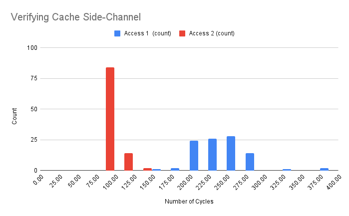

Raheem Idowu
ECE 580 Final Project
05/07/25
### Introduction
Motivated by the continued significance of speculative execution attacks like Spectre and Meltdown, I decided to attempt to reproduce Spectre V1 for my ECE 580 Final Project. While I had a high-level understanding of the different components in the attack such as speculative execution and branch prediction, I wished to use this opportunity to go hands-on and get a deeper understanding into how all these parts work together in the vulnerability.

In this project writeup I will assume that the reader already knows the basics of speculative execution attacks, so I can focus more on the low-level details and observations of my undertaking. The end goal of this project was to demonstrate the attack with my own code on my own hardware. I split this goal into the following sub goals:

- Verifying the existence of a cache side-channel
- Using this side-channel to leak information
- Combine this with transient execution to leak secrets - Spectre attack complete!

This writeup will be structured as follows. I will first describe my target system, including CPU details and potential mitigations. I will then go through how I achieved each of the 3 sub goals above and what I learnt from them. Finally I will end with a summary of my findings and ideas for future work. For the rest of this writeup I will use Spectre and Spectre V1 interchangeably.
### System Details
As I am running a Linux computer, I used the Linux commands `/proc/cpuinfo` and `lscpu` to get information on my target system:
- OS: `6.12.11-1-MANJARO`
- CPU: `Intel(R) Core(TM) i5-1145G7`, which has a cache line size of `64 bytes` and a total L1 data cache size of  `128 KiB`. It was released in `Q1 2021`, around `3` years after the Spectre family of vulnerabilities were disclosed. 

These system details are important, because as we will see, the exploitability of Spectre is highly dependent on these system details. From `lscpu` we are told that this CPU is not affected by Meltdown but is theoretically still vulnerable to Spectre V1. `lscpu` informs us that the following mitigation is present: `usercopy/swapgs barriers and __user pointer sanitization`. 

From the official [Linux website](https://docs.kernel.org/admin-guide/hw-vuln/spectre.html), this is a kernel mitigation that protects vulnerable branches that could be used as Spectre gadgets and facilitate a Spectre attack. If I wanted to attack the kernel and read kernel memory for my Spectre demonstration, I would have to disable this mitigation. However, for the sake of time, I am pursuing a userland Spectre attack for this project. 

Userland Spectre works as follows: one could imagine two processes (victim and attacker) that are communicating, maybe across some shared memory mapping. If the victim process has a Spectre gadget that the attacker could control, for example through their communication or shared services, the attacker process could potentially utilize the cache side-channel to read anything within the victim processes memory, not just their shared mapping. One can imagine kernel spectre as a form of userland spectre where the victim process is actually the kernel and communication happens through syscalls, for example.

Since branch prediction is a fundamental CPU optimization, Spectre has not been fixed at the hardware level at all. The only defense possible is to remove Spectre gadgets from the process, which is exactly the mitigation present in my system. All in all, this mitigation does not need to be disabled as I will be demonstrating userland Spectre.
### Verifying the Cache Side-Channel 
The first step in this project was verifying the cache side-channel. On any system, we know that caches are faster than RAM, but how consistent and pronounced this speedup is will impact any potential side-channel attack on that system. As a result, I created a simple program `verify_side_channel.c` that does the following:

- flushes a variable `x` from the cache
- times an access to the variable `x` (access 1)
- times another access to the variable `x` (access 2)

We ran this program `100` times, plotting the distribution of access 1 latencies with access 2 latencies. The graph is below:


We see that it is easy to tell if a variable was not in the cache before access (~250 cycles), or if it was already present before access (~75 cycles). As a result, this gives us confidence to move on to the next subgoal of this project, which is using this side-channel to leak information.

Here are some implementation details from this program:

- Intel CPUs have an instruction called `clflush` that flushes a memory location from all levels (L1, L2, and L3) of the cache. This instruction can be accessed through the GCC intrinsic library `<x86intrin.h>`. 
- Also found in the GCC intrinsic library, we use the instruction `rdtsc` that allows us to get a clock timestamp of the current CPU our process is running on. This kind of timing source is called a high-precision timer and is very important for side-channel attacks. 

The non-determinism in `rdtsc` timing comes from the fact that the CPU may deschedule the current process and run other processes while one is timing some operation. As a result, the number of cycles elapsed may differ depending on many factors.

- As our program doesn't use `x` to compute anything, there is a danger that it might be optimized away by the compiler. As a result, the `volatile` keyword comes in handy, telling the compiler not to make assumptions about the usage of our variable.

### Leaking Information with Flush and Reload
Our next step is to use this side-channel to leak information. We will use the tried and tested flush and reload strategy, where we flush a cache line, allow the victim to run, and time our "reload" of that cache line.

To demonstrate flush and reload, I wrote a C program `flush_and_reload.c` that simulates using flush and reload to infer a read location. Our victim process (which is simplified in this program as a function called `victim_process`) will read at a specific location (which is user supplied as a command line argument) in a shared buffer. The attacker code will flush this buffer beforehand, and use the cache side-channel to stealthily infer the location that was accessed:

```c
#define CACHE_LINE_SIZE 64 
void victim_process(int y) {
 	volatile char x = buffer[CACHE_LINE_SIZE * y];
}
```

(The goal of the attacker is to determine what value `y` was used in the above function through the cache side-channel)

Since the cache line size is `64` bytes, the granularity of information leakage we can technically achieve is also `64` bytes.

The first attempt at this attack did not work and it is quite illuminating to understand why. Let us say we have `n` cache lines and we want to know which one of those have been read from. We could flush all of these, allow the victim to run, and then reload all of these cache lines in sequence `0, ..., n`, making note of the access latencies. This does not work, and a closer look at the access latencies shows that while the access at the first cache line may be slow, all of the succeeding accesses are fast, indicating that the victim process somehow accessed all of them...

We know that is not true, so what is happening? The reason why we get this confusing result is due to **hardware prefetching**. Modern CPUs attempt to predict what memory locations will be used in the future, and bring them into the cache before they are used. Since we are linearly walking through the cache lines, it is quite easy for a hardware prefetcher to pick up on this pattern and bring the blocks we "need" into the cache early, ruining our attack.

One solution is to access the cache lines in a mangled or semi-random fashion. For example if `n = 255`, at step `i` of the reload stage, one could access `((i * 167) + 13) & 255`. This will still reload every single cache line, however since the pattern is harder to predict for the hardware prefetcher, it may not make predictions and leave the cache untouched for our analysis. 

The formula `((i * 167) + 13) & 255` is from the pwn.college [video](https://www.youtube.com/watch?v=vh8NxJ7YrO0&list=PL-ymxv0nOtqoU92gd9MEX4ABDGW6nvVma) on Flush and Reload where it is demonstrated that this mangling defeats the hardware prefetcher on a `Intel® Xeon® Processor E5-2670` from 2012. 

Unfortunately, this mangling strategy **did not** work on my computer and the cache timings were still too noisy to consistently and accurately leak the victim's access location. Looking at the timing numbers, it seemed that the prefetcher struggled more with its predictions. However, the prefetcher was so aggressive that it managed to still predict a significant number of cache lines. This makes sense as my laptop's processor is almost 10 years newer than the Xeon processor, and therefore probably more advanced and effective.

After considering the possibility of disabling the hardware prefetcher, which is theoretically possible through Model Specific CPU Registers, I decided to eventually try a more relaxed version of Flush and Reload that did end up working. Instead of flushing all relevant cache lines and then reloading them all together, one could imagine a relaxed scenario where the victim is repeatedly reading from a location. In that case, the attacker could flush and reload one cache line at a time - testing each location and letting the victim run in between. Then we would have no issues with the prefetcher because regardless of what it brings into the cache, we will always flush the cache line we are interested in before measuring it.

This worked very well. However, it is unlikely any real victim would read so many times from the same memory location. Therefore, we could try the attack at a lower granularity. Instead of attempting to determine whether the process read from cache line `1, 2, or 3`, we can instead space these cache lines and determine whether the process read from cache line `1, 4, or 7`. If these cache lines are far enough from each other, the prefetcher will assume that these are unrelated accesses (as it violates the principle of spatial locality), and will not attempt to guess the pattern. Therefore, prefetching is not a big issue for real world exploits. Most Spectre gadgets in the kernel that are actually exploited have huge spacings of one page, `4KiB`. (Naturally because the kernel deals with page-sized structures often.) 

In the end, the output from `flush_and_reload.c` looks like this (terminal output):
```
$ gcc flush_and_reload.c -o flush_and_reload
$ ./flush_and_reload 90
Cache hit at 90. Time: 92
$ ./flush_and_reload 180
Cache hit at 180. Time: 99
```

To summarize, after struggling and learning about hardware cache prefetching, I was able to showcase a very reliable flush and reload on my local hardware. This is how we will exfiltrate information in our Spectre attack, determining what memory location was accessed by a misspeculated transient load instruction.
### The actual Spectre attack
While Spectre's key selling point is to be able to cross isolation boundaries like process to process or process to kernel, we will demonstrate the Spectre attack in a single process. We will have a victim function that will make a read again, but this read will be protected by some bounds check. Our program will show that even though the function has this bounds check, due to the cache side-channel we can still read out of bounds by looking at the cache traces left by the transiently executed loads.

Even though the victim and attacker are in the same process here, this is exactly how interprocess or even kernel Spectre would work. In the code, `buffer` represents a shared memory mapping between the two processes and through leaking the victim's transient reads from this `buffer` the attacker can read the `secret` string that is not normally accessible through the `victim_function` (due to the bounds check):

```c
unsigned int array1_size = 16;
uint8_t unused1[64];
uint8_t array1[16] = {1,2,3,4,5,6,7,8,9,10,11,12,13,14,15,16};
uint8_t unused2[64];
uint8_t buffer[BUFF_SIZE * CACHE_LINE_SIZE];
char * secret = "You can't read this";
uint8_t temp = 0;

void victim_function(size_t to_read) {
	if (to_read < array1_size) {
		temp &= buffer[CACHE_LINE_SIZE * array1[to_read]];
	}
}
```

(The victim code has a supposedly protected read into a shared buffer. Spectre allows us to bypass the check and read beyond the bound `array1_size`)

As I already had our flush and reload exfiltration method established, the only thing left for me to do was to train the branch predictor to misspeculate the branch and use my flush and reload strategy to detect the trace and determine `secret`.

This **did not** work. Since I knew that the cache side-channel attack component was working well, the issue had to be with the transient execution. After changing how I trained the branches, I re-read the original paper and remembered that in order for the processor to speculate on the branch it must be held up by the bounds check. In particular, the variable that the `victim_function` uses in the bounds check should not be in the cache, prompting the CPU to begin speculating the load as it waits for the RAM.

Unfortunately, this did not work either. I did try some other things, but could not manage to get any sensible data from my local computer. I decided to confirm that my computer was vulnerable to Spectre V1 so I downloaded a PoC from [GitHub](https://github.com/crozone/SpectrePoC). At the time Spectre was released, this PoC was effective on a large variety of Intel and AMD CPUs and I fully expected it to work on my computer.

Surprisingly it did not work, indicating somehow that my laptop CPU was not vulnerable to Spectre. I was 100% sure it was vulnerable, and I still believe that on a fundamental level it is vulnerable. As we will see later in this writeup, Spectre is a very elusive bug and it could be that due to some quirks in the CPU design, the exact methods used in the PoC and my attempted exploitation were not successful.

I still wanted to demonstrate Spectre so I was able to find another computer (this time a desktop) to use, this time with the following specifications:
- CPU: `Intel(R) Core(TM) i7-9750H`, which has a cache line size of `64 bytes` and a total L1 data cache size of  `192 KiB`. It was released in `Q2 2019`, around `1` year after the Spectre family of vulnerabilities were disclosed. 

This one is also vulnerable to Spectre V1 and V2, but since it is a little older it is also vulnerable to Meltdown. While the Github PoC worked on this machine, my version did not so I got back to trying to get it to work.
### The elusive Spectre
Using the Github PoC as my guide, I tweaked my Spectre implementation iteratively but could simply not get it to work. In the end, it seems like the difference in implementation boiled down to the exact method of the branch predictor training. Consider the difference in the following two snippets A and B:

Snippet A:
```c
for (int j = 4; j >= 0; j--) {
	_mm_clflush(&array1_size);
	for (volatile int z = 0; z < 100; z++) {}

	/* Bit magic to set x=training_x if j%6!=0 otherwise target_x */
	x = ((j % 6) - 1) & ~0xFFFF;
	x = (x | (x >> 16));
	x = training_x ^ (x & (target_x ^ training_x));
 
	victim_function(x);

}
```

Snippet B:
```c
_mm_clflush(&array1_size);
for (volatile int z = 0; z < 100; z++) {}
victim_function(training_x);

_mm_clflush(&array1_size);
for (volatile int z = 0; z < 100; z++) {}
victim_function(training_x);

_mm_clflush(&array1_size);
for (volatile int z = 0; z < 100; z++) {}
victim_function(training_x);

_mm_clflush(&array1_size);
for (volatile int z = 0; z < 100; z++) {}
victim_function(training_x);

_mm_clflush(&array1_size);
for (volatile int z = 0; z < 100; z++) {}
victim_function(target_x);
```

These code snippets are both calling the `victim_function` with a valid `training_x` 4 times to train the branch predictor, before calling the `victim_function` with the invalid `target_x` and get the transient execution.

One would expect both of these to be the same as we are just unrolling the loop. However, only the one with the loop (Snippet A) works for Spectre (this is the construct used in the GitHub PoC). I tried to manually compare the assembly to see whether the compiler was using vastly different CPU instructions but it was not clear from that analysis what the issue was. It is also weird that the loop-based code works as one would expect the branches inside the loop to potentially ruin the branch predictor training.

This example shows just how elusive Spectre is. Since it relies on unobservable and undocumented execution semantics in the CPU, even very similar assembly code can have different results. This is why I maintain that my laptop is vulnerable to Spectre V1. I just haven't found the exact sequence of instructions that will get the desired transient execution.

In the end, duplicating this loop-based bitwise operations construct, I finally got my own version of the Spectre attack working on the desktop computer. The code is in `spectre.c` and it produces the following output:

```
Cache threshold is set to 80.
Character 0: Y (ASCII 89)
Character 1: o (ASCII 111)
Character 2: u (ASCII 117)
Character 3:   (ASCII 32)
Character 4: c (ASCII 99)
Character 5: a (ASCII 97)
Character 6: n (ASCII 110)
Character 7: ' (ASCII 39)
Character 8: t (ASCII 116)
Character 9:   (ASCII 32)
Character 10: r (ASCII 114)
Character 11: e (ASCII 101)
Character 12: a (ASCII 97)
Character 13: d (ASCII 100)
Character 14:   (ASCII 32)
Character 15: t (ASCII 116)
Character 16: h (ASCII 104)
Character 17: i (ASCII 105)
Character 18: s (ASCII 115)
```

Just for demonstration, on my laptop computer this code consistently gives nondeterministic junk like the following:

```
Cache threshold is set to 80.
Character 0: Y (ASCII 89)
Character 1: � (ASCII -54)
Character 2: A (ASCII 65)
Character 3: L (ASCII 76)
Character 4: c (ASCII 99)
Character 5: X (ASCII 88)
--snip--
```
### Summary and Ideas for Future Work
For my ECE 580 project, I implemented the transient cache side-channel attack Spectre V1. I began by verifying the existence of a cache side-channel, before implementing flush and reload on my own hardware. On the way, I learnt about hardware prefetching and how it can be bypassed. I also experienced the challenges of exploiting such low-level vulnerabilities. Modern CPUs are very complicated and prone to race conditions, so working with them can be frustrating. 

I could not get the entire attack working on my initial target computer (the laptop), but I found another computer (the desktop) where I was able to exploit Spectre on real hardware using my own code. However, this code did take a key snippet from an already established Spectre PoC online, because for some reason the bitwise operations trick the PoC used was the only thing that worked, with many equivalent code snippets I tried somehow not working.

For future work I notice that there is very little online about the continued exploitability of Spectre V1 on today's computers, 6-7 years after its release. It was interesting to see that my laptop is apparently not vulnerable to the attack, and I would like to investigate why this is the case. In addition, it would be illuminating if I could figure out the key difference between Snippet A and Snippet B. However, I expect that to be a difficult undertaking, again due to the challenges with understanding with today's high-performance CPUs.

Thank you for reading!
